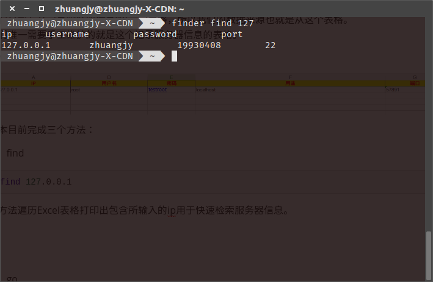
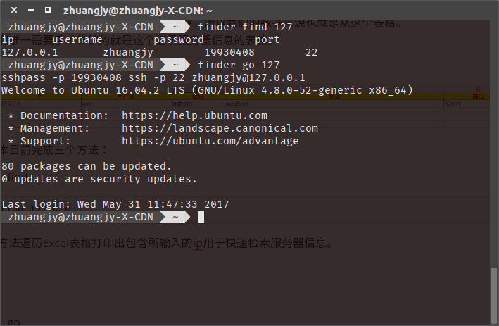
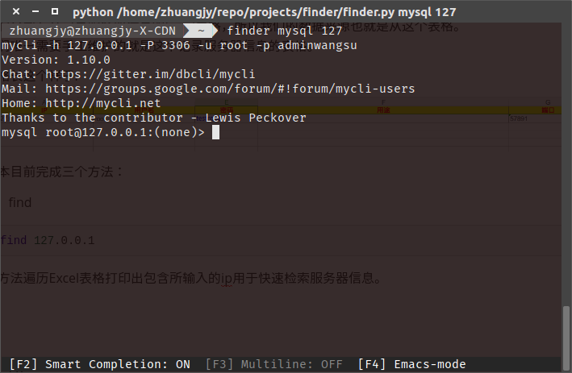

# finder
Linux下终端快速远程ssh登录服务器、远程mySQL连接解决方案。

## 背景
在Windows下使用xshell可以方便的记住很多服务器信息，快速登录。
但是在Linux下使用终端要记住这么多服务器信息就比较困难了，更难以使用免密直接登录，
bizhibizhibizhi除此之外，在工作中通常有多个MySQL服务器，也有同样的痛点。
finder是我自己写的一个小脚本用于改善Linux下多服务器、MySQL服务器使用的不便。

## 实现
我们公司有个记录服务器信息的Excel表格，所以我们的数据来源也就是从这个表格。
我们唯一需要手工维护的就是这个记录服务器信息的表格。

表格长这个样子:


脚本目前完成三个方法：
* find
``` bash
find 127.0.0.1
```
该方法遍历Excel表格打印出包含所输入的ip用于快速检索服务器信息。




* go
``` bash
go 127.0.0.1
```
该方法登录指定的ip机器。




> 命令行带上密码的SSH登录基于sshpass所以使用前请先安装。


* mysql
``` bash
mysql 127.0.0.1
```
该方法使用mycli连接指定Mysql服务器。



> mycli是一个更智能的轻量mysql客户端，如果不需要使用mycli可以修改代码使用原生的mysql客户端。


## 安装

### 环境需求

1. Linux 环境

2. Python 2 （Python 3 应适当修改源码适配）

3. sshpass 

   源码下载地址：[http://sourceforge.net/projects/sshpass/](http://sourceforge.net/projects/sshpass/)

   1. tar -zxvf sshpass-1.05.tar.gz
   2. cd sshpass-1.05
   3. ./configure
   4. make && make install

4. mycli

   ``` bash
   pip install mycli
   ```
5. xlrd (Python 读取excel包)
``` bash
pip install xlrd
```


### 安装以及使用

``` bash
git clone https://github.com/iamjohnnyzhuang/finder.git
sudo ln -s $PWD/finder.py /usr/bin/finder
```


